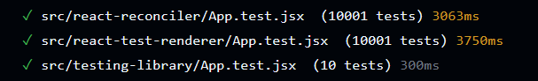

# react-test-renderer-sandbox

Demonstrates that DOM-based tests are 100-1000 times slower than React Element-based tests

```bash
npm install
npm test
npm run dev
```

View timings in [Github Actions](https://github.com/larsthorup/react-test-renderer-sandbox/actions/workflows/ci.yml):



## react-test-renderer

- [x] render
- [x] useState
- [x] click
- [x] nested components
- [x] shallow rendering
- [x] props
- [x] deep find helpers
- [x] shallow find helpers
- [x] useEffect
- [x] compare speed to RTL: <0.2ms (300ms in Jest/jsdom, 40ms in Mocha/Firefox)
- [x] async / timers, mock time, wait (fetch)
- [x] find by text

## react-reconciler

- [x] custom renderer
- [x] props
- [x] root assertions
- [x] compare speed: 3000 tests/second Count.test.jsx
- [x] click
- [x] nested components
- [x] deep find helpers
- [x] useEffect
- [x] async / timers, mock time, wait (fetch)
- [x] compare speed: 2500 tests/second (react-test-renderer: 2000, testing-library: 8) App.test.jsx
